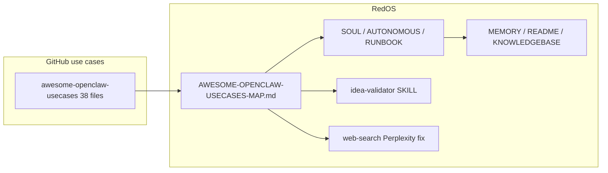

# Awesome-OpenClaw Use Cases vs RedOS — Enhancement Plan

## 1. Use-case repo and OpenClaw alignment

**Source:** [awesome-openclaw-usecases/usecases](https://github.com/hesamsheikh/awesome-openclaw-usecases/tree/main/usecases) — 38 markdown use cases.

**OpenClaw compatibility:** Patterns rely on standard OpenClaw primitives: [agents](https://docs.openclaw.ai/cli/agents), [skills](https://docs.openclaw.ai/skills), [cron](https://docs.openclaw.ai/cron) (scheduled agent sessions with web search, tools, multi-channel delivery), [sessions_spawn/sessions_send](https://docs.openclaw.ai/concepts/agent-workspace), file-based coordination. No custom forks required.

---

## 2. Comparison: what we have vs what use cases describe

### Fully or largely covered (no major code change)

| Use case                               | RedOS equivalent                                                                                                                                                      |
| -------------------------------------- | --------------------------------------------------------------------------------------------------------------------------------------------------------------------- |
| **multi-agent-team**                   | 8 agents, STATE.yaml, GOALS.md, DECISIONS.md, standups, Telegram + Slack, per-agent crons ([SOUL.md](workspace/SOUL.md), [RUNBOOK.md](workspace/RUNBOOK.md))          |
| **autonomous-project-management**      | STATE.yaml, AUTONOMOUS.md, sessions_spawn/send, thin RED coordinator                                                                                                  |
| **knowledge-base-rag**                 | [semantic-memory](workspace/skills/semantic-memory/) + [rag-url-ingestion](workspace/skills/rag-url-ingestion/) (Qdrant, bge, memsearch.py)                           |
| **semantic-memory-search**             | Same RAG stack; index path `~/.openclaw/.memsearch/qdrant/`, reindex cron 3am                                                                                         |
| **custom-morning-brief**               | Daily brief cron with tasks + AI-recommended section ([RUNBOOK](workspace/RUNBOOK.md))                                                                                |
| **n8n-workflow-orchestration**         | [n8n-webhooks](workspace/skills/n8n-webhooks/) skill, credential isolation                                                                                            |
| **habit-tracker-accountability-coach** | [habit-tracker](workspace/skills/habit-tracker/) + habit-check-in-daily cron                                                                                          |
| **earnings-tracker**                   | [earnings-tracker](workspace/skills/earnings-tracker/) + earnings-tracker-weekly cron                                                                                 |
| **self-healing-home-server**           | system-pulse cron, [self-healing-auto](workspace/skills/self-healing-auto/) / [self-healing-protocol](workspace/skills/self-healing-protocol/), OPS launchctl restart |

### Partially covered — enhance or document

| Use case                            | Current state                                                                             | Gap                                                                                                                                                                                                                                                                         |
| ----------------------------------- | ----------------------------------------------------------------------------------------- | --------------------------------------------------------------------------------------------------------------------------------------------------------------------------------------------------------------------------------------------------------------------------- |
| **pre-build-idea-validator**        | [idea-validator](workspace/skills/idea-validator/) uses web_search + grep + DECISIONS     | Use case uses **idea-reality-mcp** (GitHub, HN, npm, PyPI, Product Hunt). Consider adding MCP to allowlist and referencing in idea-validator for ENG.                                                                                                                       |
| **dynamic-dashboard**               | Mission Control dashboard, threshold alerts cron                                          | Use case spawns **sub-agents per data source** for parallel fetch. We have single-agent cron; document or add “spawn per source” pattern for key panels.                                                                                                                    |
| **project-state-management**        | STATE.yaml, TICKET-TRACKER, STANDUP-LOG                                                   | Use case uses **event-sourced DB** (progress/blocker/decision/pivot) + git-linked standup. We have file-based; optional: file-based events (e.g. `workspace/ops/events.jsonl`) for “why did we decide X” and standup from events.                                           |
| **multi-source-tech-news-digest**   | Research weekly digest, competitive-intel                                                 | Use case: 109+ sources (RSS, X, GitHub, web), scored digest. We have neither tech-news-digest skill nor multi-source cron. Option: document [ClawHub tech-news-digest](https://clawhub.ai/skills/tech-news-digest) or add RESEARCH cron that uses web_search + aggregation. |
| **market-research-product-factory** | [competitive-intelligence](workspace/skills/competitive-intelligence/), research pipeline | Use case: “Last 30 Days” Reddit/X research → pain points → **build MVP**. We lack explicit “research → opportunities → add to AUTONOMOUS → ENG build” flow.                                                                                                                 |
| **second-brain**                    | RAG + memory; no dedicated capture channel                                                | Use case: “text to remember” + searchable UI. We have RAG and habit-log; no dedicated “second brain” topic/channel or Cmd+K UI.                                                                                                                                             |
| **content-factory**                 | Research→ENG pipeline                                                                     | Use case: Research → Writing → Thumbnail agents, chained. We have research→ENG; no writing/thumbnail chain.                                                                                                                                                                 |

### Not yet implemented (candidate additions)

| Use case                                | Suggestion                                                                                                                                                                                                          |
| --------------------------------------- | ------------------------------------------------------------------------------------------------------------------------------------------------------------------------------------------------------------------- |
| **self-healing-home-server (extended)** | Email triage cron; knowledge extraction from notes into RAG; **daily security audit** (secrets scan, privileged containers) — document in RUNBOOK or add OPS cron.                                                  |
| **custom-morning-brief (extended)**     | Use case stresses **“tasks the AI can complete autonomously”**. Add explicit rule: RED (or brief cron) must add at least one AI-recommended task to AUTONOMOUS.md and assign so agents execute without being asked. |
| **Research autonomy**                   | Perplexity 401 blocks web_search (TICKET-20260301-011). Fix key/rotation so RESEARCH can search; ensure crons that need internet have `delivery.channel` and use RESEARCH or web_search path.                       |

---

## 3. Plan: what to do on the feature branch

### Step 1 — Branch and mapping doc (single source of truth for the agent)

- Create feature branch: `feature/awesome-openclaw-usecases` (or `feature/autonomous-company-enhancements`).
- Add `**workspace/docs/AWESOME-OPENCLAW-USECASES-MAP.md`** (or `workspace/ops/AWESOME-OPENCLAW-USECASES-MAP.md`):
  - Table: all 38 use cases with columns **Use case**, **Have / Partial / Missing**, **RedOS location** (skill/cron/doc), **Enhancement notes**.
  - References: [awesome-openclaw-usecases](https://github.com/hesamsheikh/awesome-openclaw-usecases/tree/main/usecases), [OpenClaw docs](https://docs.openclaw.ai), [OpenClaw showcase](https://openclaw.ai/showcase).
  - Purpose: so the agent can “internally conduct research and implement” by reading one doc and then opening use-case links and RedOS files.

### Step 2 — Autonomy without human intervention

- **SOUL.md (or AUTONOMOUS.md)**: Add explicit instruction that RED (or the daily brief cron) must **add at least one AI-recommended task from the morning brief to AUTONOMOUS.md** and assign an owner, so agents execute day-by-day without being asked.
- **RUNBOOK.md**: In “Daily summary / brief” row, note that AI-recommended tasks are to be turned into AUTONOMOUS.md entries and assigned.

### Step 3 — Research and web search

- Resolve **Perplexity 401** (key/rotation) per TICKET-20260301-011 so RESEARCH and crons can use web_search.
- **SOUL.md / COGNITIVE_ARCHITECTURE**: Reiterate that for “go to internet, search, implement,” agents must use [web-search](workspace/skills/web-search/SKILL.md) (Perplexity + Exa) and RAG before answering policy/feature questions; RESEARCH owns scheduled research crons.

### Step 4 — Idea validator and optional MCP

- In [idea-validator/SKILL.md](workspace/skills/idea-validator/SKILL.md): Add “Optional: use idea-reality-mcp (GitHub, HN, npm, PyPI, Product Hunt) if allowlisted” and link to [idea-reality-mcp](https://github.com/mnemox-ai/idea-reality-mcp). If MCP is added later, document in [mcp-server-allowlist](workspace/config/security/mcp-server-allowlist.json) and SKILL.

### Step 5 — Self-healing and security (document or light cron)

- **RUNBOOK.md** or **OPENCLAW-STANDARDS.md**: Add “Self-healing breadth” — optional crons for email triage, knowledge extraction from notes into RAG, and daily security audit (e.g. secret scan, container checks). Reference [self-healing-home-server](https://github.com/hesamsheikh/awesome-openclaw-usecases/blob/main/usecases/self-healing-home-server.md).
- No code change required unless you add new crons (e.g. OPS daily audit script).

### Step 6 — Optional: event-driven project state and tech digest

- **Event-driven state**: If desired, add file-based events (e.g. `workspace/ops/events.jsonl` or `workspace/logs/project-events.jsonl`) and one sentence in SOUL/RUNBOOK: “For ‘why did we decide X’ and standup-from-events, log progress/blocker/decision to events file.” No DB required for first version.
- **Tech digest**: In mapping doc, note “Multi-source tech news: consider ClawHub tech-news-digest or RESEARCH cron with web_search aggregation.” Implement only if agent/product owner decides.

### Step 7 — Docs and MEMORY

- Update [MEMORY.md](workspace/MEMORY.md) (under 20k chars): one short “2026-03-01 Awesome-OpenClaw use-case alignment” bullet: mapping doc added, autonomy rule (AI-recommended → AUTONOMOUS), research/web fix, optional idea-reality-mcp and self-healing breadth.
- Update [README.md](README.md) or [KNOWLEDGEBASE.md](KNOWLEDGEBASE.md): one line under Key Files for `workspace/docs/AWESOME-OPENCLAW-USECASES-MAP.md` (or chosen path).

---

## 4. What to leave to the agent

- **Implement from mapping doc**: The agent should use AWESOME-OPENCLAW-USECASES-MAP.md to open each use case, compare to RedOS, and implement only “Enhancement notes” that are approved (no custom hacks; stay within OpenClaw + existing skills/crons).
- **Branch strategy**: All changes on `feature/awesome-openclaw-usecases`; merge to `main` after review.

---

## 5. File and flow summary

- **Create**: `workspace/docs/AWESOME-OPENCLAW-USECASES-MAP.md` (full 38-use-case table + links).
- **Edit**: SOUL.md (or AUTONOMOUS.md), RUNBOOK.md, idea-validator/SKILL.md, MEMORY.md, README or KNOWLEDGEBASE; optional RUNBOOK/OPENCLAW-STANDARDS for self-healing/security.
- **Fix**: Perplexity key (TICKET-20260301-011) — operational, not in repo.
- **Branch**: `feature/awesome-openclaw-usecases` created first; all commits on that branch.

This keeps the enhancement OpenClaw-compatible, avoids custom one-offs, and gives the agent a single map to research and implement the rest like a real autonomous company.